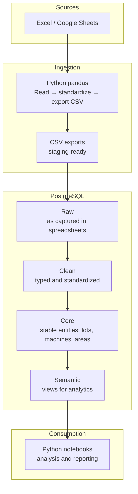

# Architecture Overview

This document describes the high-level architecture of the analytics pipeline implemented in this case study.

The focus is on **clarity, separation of responsibilities, and analytical reproducibility**, rather than low-level implementation details or infrastructure optimization.

---

## High-Level Architecture

> The Core layer represents stable reference entities (such as lots, machines, and areas).  
> It is initialized once and evolves infrequently, rather than being part of the recurring ETL cycle.

---

## Architectural Role in Analytical Decision-Making

This architecture is intentionally designed to support decision-oriented analytics, not ad-hoc reporting.

By enforcing:
- a stable data grain,
- centralized transformations,
- and curated semantic views,

the pipeline ensures that:
- predictive models are trained on consistent definitions,
- uncertainty estimates remain comparable over time,
- downstream analytical conclusions can be traced back to source data.

This stability is a prerequisite for the modeling, screening, and uncertainty-aware design tools documented in subsequent study cases.

---

## Architecture Principles

The architecture is guided by a small set of core principles:

**Single source of truth**

PostgreSQL is the authoritative layer where structure, consistency, and business rules are enforced.

**Separation of concerns**

Extraction, transformation, modeling, and consumption are handled in distinct stages to reduce coupling and prevent analytical logic from leaking across layers.

**SQL-first transformations**

Core transformations and validations are implemented in SQL, ensuring:
- centralized business logic,
- reusable transformation patterns,
- consistent analytical semantics.

**Analytics-ready design**

A semantic layer exposes curated views optimized for analytical consumption, rather than raw operational data.

**Reproducibility over convenience**

The pipeline prioritizes repeatable, deterministic results over manual or ad-hoc workflows.

---

## Data Flow

### 1. Source data

Operational and quality data originates from Excel and Google Sheets used during production and analysis activities.

### 2. Ingestion

Python and pandas are used to:

- read spreadsheet data
- standardize formats (dates, times, column names)
- export staging-ready CSV files

This step isolates extraction logic from database transformations.

### 3. Raw layer

The raw layer mirrors the original spreadsheet structure, preserving data as captured while maintaining traceability.

### 4. Clean layer

Data is standardized and validated:

- duplicates are removed
- constraints are enforced
- invalid records are detected early

Only validated data progresses further into the model.

### 5. Core layer

Stable entities that exist independently of analytical use cases (such as lots, machines, and production areas) are modeled here, providing a consistent backbone for analysis.

### 6. Semantic layer

Analytical views and tables are built to reflect common analytical questions, exposing data at well-defined grains with consistent definitions.

### 7. Consumption

Python notebooks consume the semantic layer to perform analysis, aggregation, and reporting.

---

## Why This Architecture Works

- New data can be added without breaking existing analyses
- Analytical logic is centralized and versionable
- Model inputs remain stable across time and systems
- Analysts reason over curated semantics instead of raw operational noise

This stability is critical when analytics are used to support engineering decisions, where inconsistent definitions can lead to incorrect conclusions and increased operational risk.

---

## Summary

This architecture is not intended to be a full data platform.

It is a disciplined analytical backbone designed to:

- replace fragile spreadsheet-based workflows,
- enforce semantic consistency,
- and enable reliable modeling and decision-support analytics.

Its value lies not in technical novelty, but in providing the stability required for uncertainty-aware, engineering-driven analytical work.

---