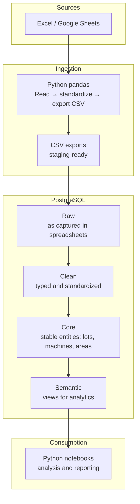

# Architecture Overview

This document describes the high-level architecture of the analytics pipeline implemented in this case study.  
The focus is on clarity, separation of responsibilities, and reproducibility rather than low-level implementation details.

---

## High-Level Architecture

> The Core layer represents stable reference entities (such as lots, machines, and areas).  
> It is initialized once and evolves infrequently, rather than being part of the recurring ETL cycle.

## Architecture Principles

The architecture was designed around a small set of core principles:

- **Single source of truth**

    PostgreSQL is the authoritative layer where structure, consistency, and business rules are enforced.

- **Separation of concerns**

    Extraction, transformation, modeling, and consumption are handled in distinct stages to reduce coupling.

- **SQL-first transformations**

    Core transformations and validations are implemented in SQL to ensure consistent analytical logic.

- **Analytics-ready design**

    A semantic layer exposes curated views optimized for analytical consumption.

- **Reproducibility over convenience**

    The pipeline prioritizes repeatable, deterministic results over ad-hoc manual workflows.

## Data Flow

### 1. Source data

Operational and quality data originates from Excel and Google Sheets used during production and analysis activities.

### 2. Ingestion

Python and pandas are used to:

- read spreadsheet data
- standardize formats (dates, times, column names)
- export staging-ready CSV files

This step isolates extraction logic from database transformations.

### 3. Raw layer

The raw layer mirrors the original spreadsheet structure, preserving data as captured while maintaining traceability.

### 4. Clean layer

Data is standardized and validated:

- duplicates are removed
- constraints are enforced
- invalid records are detected early

Only validated data progresses further into the model.

### 5. Core layer

Stable entities that exist independently of analytical use cases (such as lots, machines, and production areas) are modeled here, providing a consistent backbone for analysis.

### 6. Semantic layer

Analytical views and tables are built to reflect common analytical questions, exposing data at well-defined grains with consistent definitions.

### 7. Consumption

Python notebooks consume the semantic layer to perform analysis, aggregation, and reporting.

## Why This Architecture Works

New data can be added without breaking existing analyses

- Analytical logic is centralized and reusable
- The model can evolve as processes and analytical needs change
- Analysts interact with curated datasets instead of raw operational data

This structure supports both day-to-day analysis and long-term analytical growth.